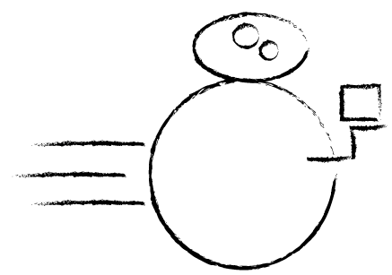

 <head>
    <meta charset='utf-8'>
    <meta http-equiv="X-UA-Compatible" content="chrome=1">
    <link href='https://fonts.googleapis.com/css?family=Chivo:900' rel='stylesheet' type='text/css'>
    <link rel="stylesheet" type="text/css" href="stylesheets/stylesheet.css" media="screen">
    <link rel="stylesheet" type="text/css" href="stylesheets/github-dark.css" media="screen">
    <link rel="stylesheet" type="text/css" href="stylesheets/print.css" media="print">
    <!--[if lt IE 9]>
    
    <![endif]-->
    <title>Bflat by 60East</title>
  </head>

BFLAT
=====

> _These are the droids you're looking for._

BFlat combines the efficiency of simple, schemaless formats with the ability to manage binary data and preserve the full precision of numeric values.

It's fast. It's precise. It's simple. It's self-describing.

BFlat is designed to be ideal for low-latency, high-throughput messaging that requires binary data or requires messages to preserve the precision and type of numeric values. No strong coupling.

  <section id="downloads" class="clearfix">
          <a href="https://github.com/60East/bflat/zipball/master" id="download-zip" class="button">Download .zip</a>
          <a href="https://github.com/60East/bflat/tarball/master" id="download-tar-gz" class="button">Download .tar.gz</a>
          <a href="https://github.com/60East/bflat" id="view-on-github" class="button">View on GitHub</a>
        </section>

